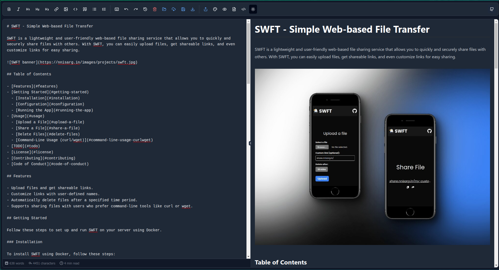

# YAME: Yet another Markdown Editor
YAME is a simple and lightweight Markdown editor built with React. It allows users to write and preview Markdown content in real-time.

> **Baptism of Code Ongoing, to remove the sins of the developer, future commits may contain breaking Changes**



## Getting Started
To get started with Yame, open [Yame](https://notoriousarnav.github.io/MarkdownEditor/) in your browser. If you are using **Chromium based Browsers** you can install it straight from the browser, regardless of the OS/Platform you are on. 

## Features
- Supports Github, Notion, Dev.to and Medium markdown flavors
- ~Meth~ Math Support
- File Sharing Support ( Thanks @hect1k )
- Allows exporting to PDF and HTML
- Minimal and Lightweight (debatable, but atleast its lighter than ur mom)
- No Server-side dependencies (Really)
- Autosave
- Toggle Preview Mode using URL bar, just add `?preview=true` to the URL
- Fetch Remote file with `?fetchFrom=theUrl`
- File Open, Local and Remote
- PWA Support, so you can just Install the App from the Browser it self!

## TODOS:
- **MAIN FOCUS** Extensions Support to allow devs to make custom extensions and add them to the editor
- Multi File Support to allow multiple tabs and allow Notebook like functionality like Obsidian **Sometimes I think this is unnecessary**
- Allow custom themes **Yeah man, this is a TODO**
- Allow changing Code Block Themes
- Add more Markdown flavors
- Get a Nice Logo **Important**

[](https://www.youtube.com/watch?v=ufgCsc758yw)

## Running
### Clone Repo
To clone this Repo:
```bash
git clone https://github.com/NotoriousArnav/MarkdownEditor.git
```
### Install Dependencies
To Install Dependencies run:
```bash
npm i
```

### Changing the SWFT Instance
The Default SWFT Instance is `https://share.nnisarg.in`
To change the SWFT Instance run:
```bash
export VITE_SWFT_INSTANCE="https://someinstance.com"
# or
echo "VITE_SWFT_INSTANCE='https://someinstance.com'" > .env
```

### Development Server
To run the application, use the following command:
```bash
npm run dev
```
### Build
#### Build for production
To build the application for production, use the following command:
```bash
npm run build
```
#### Build for development
To build the application for development, use the following command:
```bash
npm run build:dev
```
